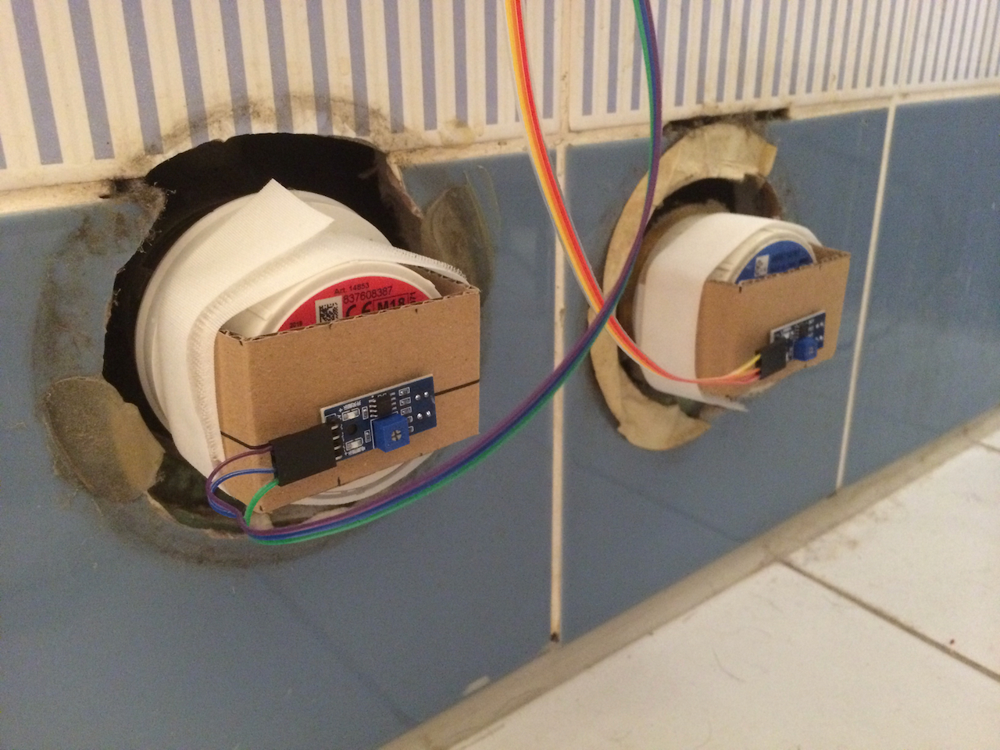

# water-meter-monitor
This is a project to measure my household water consumption in real-time using Arduino. The project also evolved a little bit to record the bathroom environment (temperature, humidity, etc).

This repo covers only the design and construction of the monitor. To record data, the [data logger](https://github.com/skhg/water-meter-logger) project also needs to be run on the same LAN.

## The finished product

A dashboard set up to display the data using [Grafana](https://grafana.com/). Again, see the [data logger](https://github.com/skhg/water-meter-logger) project for how this is set up.


The installed sensors and Arduino board. Please excuse the dirt and corroded pipes.

## Materials needed
* Hot/cold water meters with that spinning silver disc
* Arduino-compatible [NodeMCU ESP8266](https://www.amazon.de/dp/B06Y1ZPNMS/ref=pd_bap_rp_29?_encoding=UTF8&psc=1&refRID=00VJ4MZWJ40VXXT9V9F5) board.
* [BMP180 temperature/air pressure sensor](https://www.amazon.de/dp/B07D8S617X/ref=sr_1_1_sspa?dchild=1&keywords=bmp180&qid=1586084224&sr=8-1-spons&spLa=ZW5jcnlwdGVkUXVhbGlmaWVyPUE2U0dPUVNMNzREUzMmZW5jcnlwdGVkSWQ9QTAwMTk0MTUyVTVESTJRMjZUTDgyJmVuY3J5cHRlZEFkSWQ9QTA0NjE1NjEzTzFNVFFLMExJMEk4JndpZGdldE5hbWU9c3BfYXRmJmFjdGlvbj1jbGlja1JlZGlyZWN0JmRvTm90TG9nQ2xpY2s9dHJ1ZQ&th=1)
* [DHT22 temperature/humidity sensor](https://www.amazon.de/dp/B06XF4TNT9/ref=pd_bap_rp_33?_encoding=UTF8&psc=1&refRID=00VJ4MZWJ40VXXT9V9F5)
* 2x [TCRT5000 Infrared reflectivity sensor](https://www.amazon.de/dp/B017CWS47E/ref=pd_bap_rp_35?_encoding=UTF8&psc=1&refRID=00VJ4MZWJ40VXXT9V9F5)
* [Multiplexer board](https://www.amazon.de/dp/B06Y1L95GK/ref=pd_bap_rp_42?_encoding=UTF8&psc=1&refRID=XGM1T4VMY7AQ8G2ZQ25K)
* A cardboard box
* Some ribbon cables

## Design
The constraints here were that the box needed to be a little distant from the meters themselves. When someone comes along to read the meters in real life, I wanted to be able to easily disconnect things and keep everything tidy. I also wanted the humidity sensor to be on the outside, so it would respond to the ambient air quickly. The air pressure sensor could be on the inside. Conveniently the BMP180 also includes a temperature sensor, so I can get internal/external temperature difference. (Internal temperature is usually about 2°C higher).

The reflectance sensors have digital or analog output, and for this project I needed to use the analog data, so I could get a range of values, rather than a strict "on/off" value. The NodeMCU board only supports a single analog input pin, which meant I had to use the multiplexer to read the two reflectance sensors in turn.

The basic circuit diagram:


And the circuit layout on the board:


## Construction
I prototyped the circuit on a breadboard:


And installed it in this nice little box, with some slots cut out to pass through the ribbon cables for data, and the USB power cable. The humidity sensor is mounted on the outside:


The sensors were "mounted" onto the water meters using a seriously reliable setup of cardboard and velcro, with a slot cut through the cardboard to admit the infrared emitter/recievers:


And finally everything is plugged in and switched on. The sensors permanently show a lit green LED when power flows:


## Software design
As you can see in the [testing](testing/) directory, I tested the various sensors and components independently before integrating them in the [final application](water-meter-monitor.ino).

Some general configuration options are set at the top of the `.ino` file. A little further down the IP and port are specified, where the results will be sent to. Note: If nothing is listening at the far end, the application will crash and attempt to retry forever.

The job of the reflectance sensor is to try to sense whether the spinning disc has moved since the last reading. The sensor should ideally be positioned a bit further to the outside of the disc's radius, if possible. As the disc turns, the sensor's reading will rise and fall.


The reflectivity will always follow a repeating curve, e.g. as can be seen in the following graph:


During constant rotation the level will stay mostly "high" or "low" and rapidly switch between these two. However when water flow stops, it might come to a rest "half way" along the cliff. So the software needs to define two threshold values which need to be crossed, before "high" can become "low" and vice versa.

We must also deal with the case where the device reboots. This could happen due to a WiFi dropout, inability to connect to the server, or a simple power outage. Each time our recorded state changes, we write the new value to the onboard `EEPROM` memory. When we restart, this is read back and is used to continue from where we left off. Without this, reboots frequently cause invalid readings, as we go from a "null" state into a "high" or "low" state.

In `setup()` I define some memory locations where the current state of the sensors is recorded. There is also a short startup delay `STARTUP_DELAY_MS` so that the BMP180 sensor can come online. Trying to read it before its initialization is complete causes unrecoverable errors. The rest of `setup()` is mostly concerned with defining pin locations and voltages. 

In the `loop()` we take our readings, build some JSON, and fire it off to the logging server. If this works, we sleep a little bit, and then repeat. If we fail to connect for any reason, we reboot. This is a quick and easy way of avoiding WiFi reconnection which I found very problematic.

The `*_moved()` methods switch the multiplexer to read from one or other of the sensors. They then use `takeReading(...)` to get the analog reflectivity value and return it. If `CALIBRATION` is enabled they will also print the recorded value, to assist in the setup process.

The JSON sent to the server looks like:

```json
{
  "waterFlow": {
    "hotLitres": 0.5,
    "coldLitres": 0.5
  },
  "environment": {
    "humidityPercentage": 54.0,
    "airPressurePa": 102650,
    "temperatureInternalC": 25.03,
    "temperatureExternalC": 23.3
  }
}
```

## Calibration
The sensors need to be securely attached before calibration begins because even the slightest movement later on will mess it up. With the Arduino "Serial Monitor" window open, run some water and watch the values change. After a few spins of the wheel a repeating pattern will emerge, like in the graph above.

I took the values 20% below the peak and 20% above the trough, as my trigger thresholds. These will be different for any different meters you read because the combination of the sensor and the meter itself is unpredictable. These values need to be set in code and uploaded again to the Arduino board.
